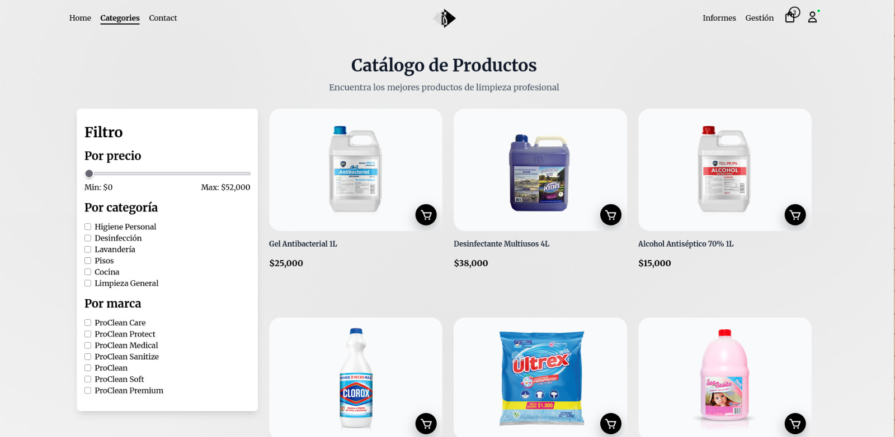

# 🫧 ProClean ERP

ProClean S.A.S. es una empresa dedicada a la venta y distribución de productos de aseo y limpieza, tanto para hogares como para organizaciones. Su misión es ofrecer soluciones de limpieza eficientes, seguras y accesibles, garantizando la calidad y disponibilidad de los productos en todas sus sucursales.

| Home | Catálogo |
| ---- | -------- |
|  |  |

## 📌 Descripción del Proyecto

Para optimizar sus operaciones, ProClean desarrollará un software especializado en la gestión de compras y ventas. Con esta herramienta se busca:

➡️ Registrar compras a proveedores y mantener actualizado el inventario por sucursal.

➡️ Gestionar ventas a clientes finales y corporativos en tiempo real.

➡️ Generar reportes consolidados que apoyen la toma de decisiones y el control administrativo.

## 🛠️ Tecnologías Utilizadas

El proyecto se desarrolla con el siguiente stack tecnológico:

- **Frontend**

  - **HTML5** → estructura semántica.
  - **CSS3** → estilos personalizados.
  - **JavaScript (ES6+)** → interactividad en el cliente.
  - **React.js** → construcción de componentes dinámicos y SPA.
  - **Tailwind** → diseño responsivo y componentes visuales.

- **Backend**

  - **Node.js** → entorno de ejecución de JavaScript en el servidor.
  - **Express.js** → framework para manejar rutas y middlewares.

- **Base de Datos**

  - **MariaDB** → gestión y persistencia de datos relacionales.

- **Infraestructura**
  - **Docker & Docker Compose** → contenedores para la aplicación y base de datos.

- **Despliegue**
  - **CloudFlare y Nginx** → Herramientas para servidor en linux.

## 📂 Estructura del Proyecto

- **backend**/ # API con Node.js y Express
- **frontend**/ # Código GUI con React
- docker-compose.yml
- .env.example # Variables de entorno de ejemplo
- README.md

## 🚀 Uso del código

Clona el repositorio:

```bash
  git clone https://github.com/smuke123/ProClean_ERP.git
```

Accede a la carpeta del proyecto:

```bash
  cd ProClean_ERP
```

Entra al archivo .env.example y copia tus credenciales de .env:

```bash
  cp .env.example .env
```

Levantar los servicios:

```bash
  docker compose up -d --build
```

## 👥 Autores

- [smuke123](https://github.com/smuke123).
- [Jadavid22](https://github.com/Jadavid22).
- [Aljrf06](https://github.com/Aljrf06).
- [CarlosBarrera21](https://github.com/CarlosBarrera21).

## 📩 Cómo contribuir

Realiza un fork del repositorio.

Crea una nueva rama con tu contribución.

Haz un pull request para revisión.
